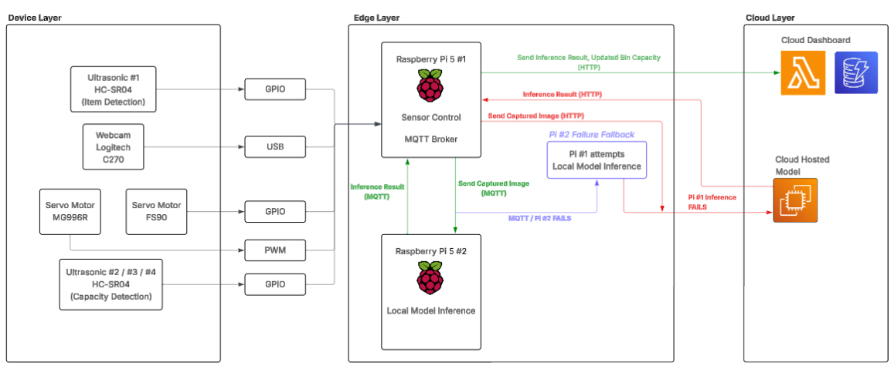

# INF2009 : SortaBin

## Introduction

Recycling is important, but people often throw the wrong waste into the wrong bin due to inconvenience or carelessness. Incorrect waste disposal increases recycling contamination and reduces the efficiency of waste management. An automated waste-sorting system can improve sorting accuracy while reducing reliance on user judgement

SortaBin is an AI-powered recycling bin that reduces recycling contamination by identifying waste items and automatically sorting them into the correct compartment using edge computing. 

---

## Project Objective

The objective of this project is to apply Edge Computing techniques. Specifically, this project aims to:

- **Objective 1:** Develop an automated sorting system using **AI image classification**.
- **Objective 2:** Identify non-recyclables vs distinct types of recyclables.
- **Objective 3:** Provide *real-time data insights* via a dedicated dashboard.
- **Objective 4:** To **minimize power consumption** using an event-driven approach.

By the end of this project, swiftly perform item classification and automated sorting within xx seconds.

---

## Architecture

**Device Layer:** Responsible for the sensor detection, camera capture, and physical actuation

**Edge Layer:** Managing sensor input, performing model inference

**Cloud Layer:** Dashboard logging and cloud-hosted model

---
### Hardware Components & Justification

| Component | Description | Justification |
|-----------|-------------|-------------|
| 2x Raspberry Pi 5| Briefly describe what this component does. | Higher RAM and can handle multitasking
| 4x Ultrasonic (HC-SR04) | Perform item and bin detection. | Compatible with Raspberry Pi using GPIO
| 1x Webcam (Logitech C270) | Image Capture | USB integration with Raspberry Pi
| 1x Servo Motor (MG996R) | Rotates the bin compartment | Stronger Torque to rotate bin
| 1x Servo Motor (FS90) | Bin Lid adjustment | Rotation for lighter weight

---

## Methodology

The following are the approaches the team adopted to optimise the project.

### Phase 1: Model Training & Testing

Searching for labelled data for waste and perform training on YOLO and MobileNetV3 models, focusing on having good accuracy and also shorter inference speed such that it can run on constrained devices such as Raspberry Pi 5.

### Phase 2: Hardware Setup
Physical connections of the different sensors with the Raspberry Pi.

### Phase 3: Dashboard Development
Developing a user-friendly dashboard (Using React and Flask) that can is easy to use and contains useful information for necessary actions if required, and host it on the cloud.

### Phase 4: Communications Testing
Setting up MQTT connections for internal Raspberry Pi communication while setting up HTTP connections for communication with cloud related services such as the hosted Dashboard and model.

### Phase 5: Profiling
Apply psutil etc. to identify bottlenecks and optimizing it after.

---

## Team Member Contribution

| Name | Contributions |
|------|---------------|
| Toh Jun Kuan Johnathan |MQTT/HTTP communications, Cloud Fallback Setup |
| Wong Che Khei | Model Training and Optimization |
| Tan Jia Xin Vanessa | Hardware Setup, Dashboard |
| Lau Xin Hui | Hardware Setup, Profiling |
| Tan Zhi Xin | Model Training and Optimization |

> All team members contributed equally to ideation, project development, and final presentation preparation.